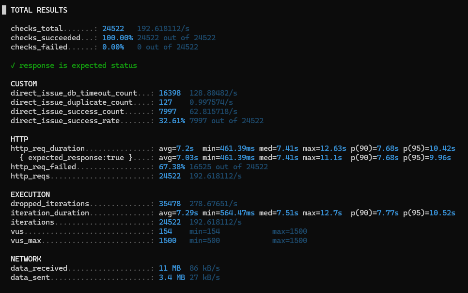
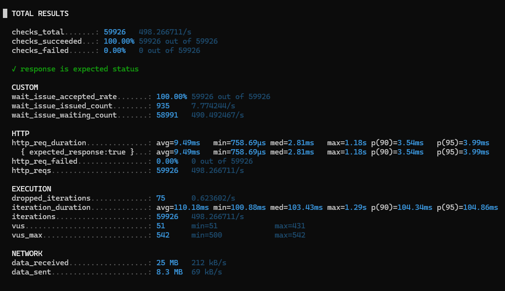

# 부하테스트 결과
- 분산 환경에서 부하테스트 전 단일서버에서 테스트 후 분산환경으로 테스트

## 단일 서버 부하테스트 결과

### 테스트 스펙

- k6 스펙
````
KTX_RPS=500
KTX_DURATION=2m
KTX_PREALLOCATED_VUS=500
KTX_MAX_VUS=1500
ACCOUNT_COUNT=100000
COUPON_ID=1
THINK_TIME_SECONDS=0.1
````

- worker 스펙
````
batch-size=1
fixed-delay=50ms
````

### 테스트 결과

- 레디스 대기열 큐 도입 전



- 레디스 대기열 큐 도입 후


- DB 커밋 완료 및 데이터 정합성


